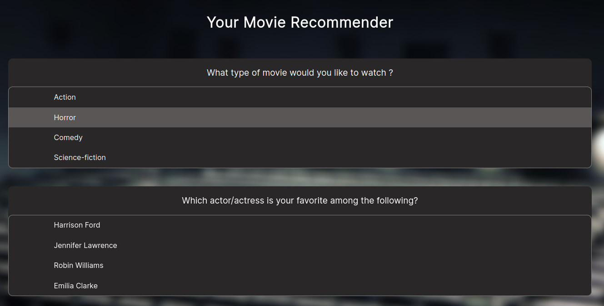

# Movie Recommender

## Description

A knowledge-based movie recommender using SPARQL and DBpedia.



## Installation

This code requires Python 3.9 or higher.

1. Clone the repository:
```
git clone https://github.com/noblotni/movie_recommender
```

2. Go to the `movie_recommender` folder and install the dependencies:
```
cd movie_recommender
pip install -r requirements.txt
```

## Run the movie recommender

To start to use the movie recommender:
```
python server_flask.py
```

and then browse to: http://localhost:5000
